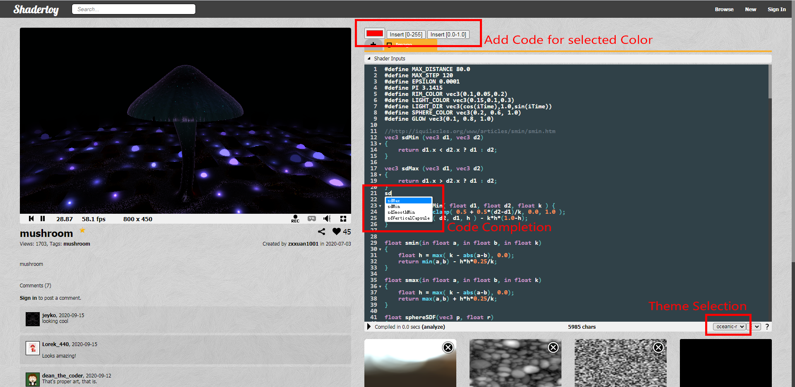

# Shadertoy Chrome Extension

## Installation

## Example

## Log

v1.0.0 Change code style

v1.1.0 add Auto Completion

v1.1.1 add Color Picker

## TODO next

- [x] ~~Change code style~~
- [ ] Change Web Style
- [ ] Guidance for build-in type
- [x] Color Picker
- [x] auto completion
- [ ] Type guidance
- [ ] Function guide
- [ ] Simple error detection
- [ ] Save
- [ ] Load

